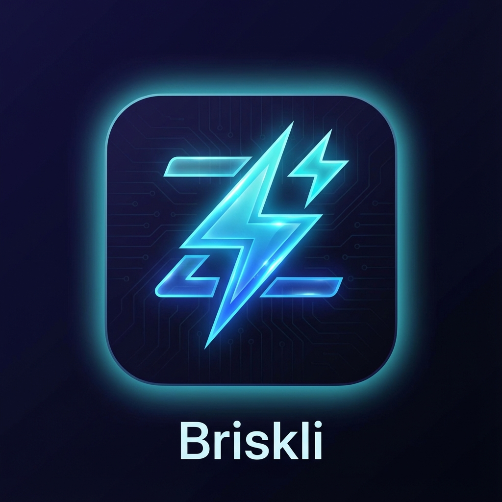

  

# Briskli
### Simple Prompt Manager for VS Code

**Briskli** is a basic sidebar extension that stores your AI prompts. Stop copying and pasting the same text repeatedly.

---

## What it does

It's a place to keep your prompts.

-   **Store Prompts**: Save your most used prompts in the sidebar.
-   **Click to Insert**: Click a card to paste the prompt into your AI chat or editor.
-   **Categories**: Organize prompts into folders like "Bugs", "Planning", and "Docs".
-   **Variables**: Auto-fill basic context like `{{language}}` or `{{framework}}` if you want.

---

## How to use

1.  Open the Briskli sidebar.
2.  Select some code in your editor.
3.  Click a prompt in the list.

That's it. It just works.

---

## Settings

-   **Tone**: Simple toggle for Tone (Casual/Professional).
-   **Response Length**: Short or Long.
-   **Import/Export**: Save your prompts to a JSON file to move them elsewhere.

---

  <b>Basic tools for productive coding.</b>

